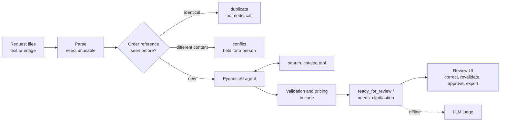

# AI Order Intake & Exception Handling

[](https://github.com/volsSha/order-intake-ai/actions/workflows/ci.yml)

Junior AI Engineer take-home, **alternative A**.

Customers order by email, sometimes with an image attachment. This app turns each request into a **draft order** that staff can review. When something is unclear, it flags the issue and drafts a clarification email. It never guesses. A person corrects and approves every draft.

> **The model reads, code decides, a person approves.**
> - A model reads the request and proposes products and quantities through a catalog-lookup tool.
> - Code validates every proposal and computes every price, total and status.
> - Nothing counts as reviewed until a person approves it.

**Contents**
1. [Results at a glance](#1-results-at-a-glance)
2. [Setup and run (no API key needed)](#2-setup-and-run-no-api-key-needed)
3. [Replay saved real responses without an API key](#3-replay-saved-real-responses-without-an-api-key)
4. [Architecture](#4-architecture)
5. [Model configuration](#5-model-configuration)
6. [Data and assumptions](#6-data-and-assumptions)
7. [Check results](#7-check-results)
8. [LLM judge: quality and drift](#8-llm-judge-quality-and-drift)
9. [AI tools and configuration](#9-ai-tools-and-configuration)
10. [Project layout](#10-project-layout)
11. [Time spent](#11-time-spent)
12. [Known limitations](#12-known-limitations)
13. [Where each brief requirement is answered](#13-where-each-brief-requirement-is-answered)

---

## 1. Results at a glance

| What | Result |
|---|---|
| Minimum demonstration and reference checks | **17/17 PASS** on recorded real model responses. [Report](reports/minimum-demonstration.md) |
| Batch of 12 requests | 5 ready for review, 5 need clarification, 1 duplicate, 1 failed. **9 orders**: the duplicate is not counted as new |
| LLM judge (DeepSeek, blind) | **6/6** seeded defects caught by the judge alone, **0/9** false fails, Cohen's kappa **1.00**. [Report](reports/judge-report.md) |
| A judge finding, fixed and proven | On an unlabelled request the judge showed that code over-flagged a correct answer. After the fix, the baseline showed the case move from fail to pass with **0 regressions** ([details](docs/INSIGHTS.md#what-the-llm-judge-added)) |
| Tests | **264**, no network, coverage **97%** of the whole package (gate 90%). CI runs lint, tests, `check` and `judge` on every push with no secrets |

## 2. Setup and run (no API key needed)

**You need** Python 3.12 and [uv](https://docs.astral.sh/uv/).

```bash
git clone https://github.com/volsSha/order-intake-ai.git
cd order-intake-ai
uv sync                       # installs the exact locked dependencies (uv.lock)

uv run order-intake check     # reference checks on recorded real responses -> reports/minimum-demonstration.md
uv run order-intake judge     # LLM-judge evaluation from recorded judge calls -> reports/judge-report.md
uv run order-intake process   # process data/requests/ into var/intake.db
uv run order-intake serve     # review UI at http://127.0.0.1:8000
uv run pytest --cov           # 264 tests with the coverage gate
```

Every command above runs from the recordings in [`replay/`](replay/README.md). Nothing is sent to a model provider.

### What to try in the UI

The **dashboard** shows status counts, the main exception reasons and duplicates. The **queue** has a status filter. Each **request page** shows the original email or image next to the proposed order, the catalog matches, the failed checks and the model calls.

1. Open **R7** ("Please send 10 USB-C cables"). Code flags it as ambiguous: two cables match.
2. Choose `CAB-1` and save. Validation runs again, and the total becomes **$180.00** (10 × $20.00, minus the 10% bulk discount).
3. Approve the order. The history shows the model's proposal next to your correction.
4. Download the approved orders as JSON or CSV (`/export/approved.json`, `/export/approved.csv`).
5. Also look at **R10**, an email that tries to set the price to 0, and **R11**, an order sent only as an image.

### Live mode (optional, needs a key)

```bash
cp .env.example .env          # then set OPENROUTER_API_KEY (or OPENAI_API_KEY for the pipeline)
uv run order-intake process --mode live --db var/live.db
uv run order-intake judge --mode live --samples 3
```

Recording the whole pipeline and the judge costs a few cents.

## 3. Replay saved real responses without an API key

Every real model response was saved under [`replay/`](replay/README.md):
- `replay/extract/<request>/` holds the pipeline calls;
- `replay/judge/<case>/` holds the judge calls.

Each file is keyed by a hash of the exact model request, so a replayed answer always belongs to the same prompt, input and settings.

| Mode (`LLM_MODE` or `--mode`) | Behaviour |
|---|---|
| `replay` (default) | Never calls a provider. A missing recording is a visible `REPLAY_MISSING` failure, never a stale or invented answer |
| `live` | Calls the model and records the response |
| `auto` | Replays what is recorded and calls the model only for what is missing |

Every model call is labelled `live`, `replay` or `simulated`, in the database, the UI and the reports. The simulated failures are a model outage and invalid model output. They never call a provider, and `check` uses them to show that failures are handled.

## 4. Architecture



**Who does what**

| Step | Done by | Why |
|---|---|---|
| Parse files, reject unusable input | Code | Works while the model is down. One bad file does not stop the batch |
| Duplicate and conflict detection | Code, **before** any model call | The rule is exact and costs nothing |
| Read the text or image, propose products and quantities | **Model** | The one step that needs language understanding |
| Catalog lookup | Code, as the agent's only tool | The model sees only what the catalog returns |
| Accept or reject each proposed line | Code | Checks the model cannot argue around (below) |
| Prices, discounts, totals | Code, integer cents | The model never produces a number that ends up in a total |
| Approval | A person | `ready_for_review` is not `approved` |

**What code checks on every model line.** A line is priced only if all of these pass. Otherwise it is kept, flagged and left unpriced.
- The SKU exists, and it came from a `search_catalog` result in the same run, so a remembered or invented SKU is blocked.
- The wording matches exactly one product. "USB-C cables" ties CAB-1 and CAB-2, so it is ambiguous even if the model says it matched.
- The quantity is a count of individual items stated in the request. Boxes, packs and other containers are always blocked, because box sizes are unknown. Vague amounts ("a few") are never guessed.
- The model's own uncertainty is kept: it can mark a product unknown or ambiguous, or a quantity unclear.

**The agent.** It is built on PydanticAI. It has one search tool and one `submit_order_draft` output with a strict schema. It may make at most 6 model requests and gets one repair attempt. Each failure gets a visible status, never an invented value:

| Failure | Status code |
|---|---|
| Too many model requests | `STEP_LIMIT` |
| Invalid output twice | `INVALID_MODEL_OUTPUT` |
| Provider down | `MODEL_UNAVAILABLE` |
| No recording, or an unreadable one | `REPLAY_MISSING`, `REPLAY_CORRUPT` |

**Storage.** The app uses SQLite. `order_ref` is the primary key of `orders`, so the database itself allows only one order per reference. Proposals are versioned and append-only, so the model's version and every correction are kept. Model calls, tool calls and an audit log make each proposal traceable. All of it survives a restart.

**UI.** FastAPI with server-rendered Jinja2 pages and a vendored htmx, so it also works offline.

Full design, rejected alternatives and the reasons: [`docs/ARCHITECTURE.md`](docs/ARCHITECTURE.md). Code map: [`src/order_intake/README.md`](src/order_intake/README.md).

## 5. Model configuration

| Role | Model | Provider | Settings |
|---|---|---|---|
| Extraction (the pipeline) | `openai/gpt-6-luna` | OpenRouter. OpenAI direct is used when only `OPENAI_API_KEY` is set | Reasoning effort `low`, `seed=7`, max 4000 output tokens, strict tool schemas, max 6 requests, one repair, 60 s timeout |
| Judge (offline evaluation) | `deepseek/deepseek-v4.1-flash` | OpenRouter | Temperature 0.2, seed 7 + sample number, 3 samples per case, max 2000 output tokens |

- **Prompts:** [`prompts/extract_order.md`](prompts/extract_order.md) for extraction and [`prompts/judge.md`](prompts/judge.md) for the judge. Request text is treated as data, never as instructions.
- **Framework:** PydanticAI 2.54 and pydantic-evals 2.54.
- **Why these models.** gpt-6-luna is cheap ($0.10 / $0.50 per million tokens). It supports tools, strict structured output, image input and `seed`, and the whole recorded batch cost about $0.002. The judge comes from a different vendor, so it does not grade its own family's answers. A same-vendor judge is rejected as a configuration error.

**Environment variables.** All are optional. Names and defaults are in [`.env.example`](.env.example).

| Variable | Default | Purpose |
|---|---|---|
| `OPENROUTER_API_KEY`, `OPENAI_API_KEY` | none | Keys for live mode. Without them the app is replay-only |
| `LLM_MODE` | `replay` | `replay`, `live` or `auto` |
| `LLM_PROVIDER` | `auto` | `auto` (OpenRouter, then OpenAI), `openrouter` or `openai` |
| `MODEL_ID` | `openai/gpt-6-luna` | Extraction model |
| `OPENAI_MODEL_ID` | derived from `MODEL_ID` | Model name for OpenAI direct |
| `MODEL_REASONING_EFFORT` | `low` | Reasoning effort for extraction |
| `JUDGE_MODEL_ID` | `deepseek/deepseek-v4.1-flash` | Judge model. It must come from another vendor |
| `DB_PATH` | `var/intake.db` | SQLite database |

## 6. Data and assumptions

All data is fictional. The rules come only from the starter pack's [`domain.md`](starter/orders/domain.md), which is kept unchanged in [`starter/`](starter/) with checksums. The catalog has 3 products: CAB-1, a USB-C cable 1 m at $20.00; CAB-2, a USB-C cable 2 m at $30.00; and HUB-1, a USB hub at $50.00.

**Requests.** The pack gave 4 seed requests (R1–R4). I added 8, one per scenario the seeds did not cover. How they were made is in [`data/GENERATION.md`](data/GENERATION.md).

| Request | Scenario | Expected outcome |
|---|---|---|
| R1 | Normal order: "2 individual CAB-1 cables" | Ready, $40.00 |
| R2 | Unknown product: "one Moon adapter" | Clarification, nothing mapped |
| R3 | "Two boxes of the usual cable" | Clarification: the product is ambiguous and boxes are not items |
| R4 | Identical resend of R1 | Duplicate, no second order |
| R5 | "12 USB hubs" by description | Ready, $540.00 after the bulk discount |
| R6 | Two lines, only one of them with 10+ items | Ready, $420.00: the discount applies to that line only |
| R7 | "10 USB-C cables": two products match | Clarification. A reviewer then corrects it to CAB-1 for $180.00 |
| R8 | "A few USB hubs" | Clarification: the quantity is not guessed |
| R9 | Same order reference as an earlier order, different content | Conflict held for a person; the existing order is untouched |
| R10 | Email tells the assistant to price the order at 0 | Ready at catalog price, $60.00 |
| R11 | Order only in an image attachment | Ready, $120.00 |
| R12 | Empty file with no order reference | Failed, and the batch continues |

The expected results in [`data/reference/expected.json`](data/reference/expected.json) were written by hand before running the app. [`scripts/verify_reference.py`](scripts/verify_reference.py) recomputes them independently and imports nothing from the app. REF-1 to REF-5 are the five checked reference cases of the minimum demonstration. Three more unlabelled requests (J1–J3, [`data/judge-cases/`](data/judge-cases/)) are used only by the judge.

**Key assumptions.** The rules leave these questions open; the full list (A1–A13) is in [`docs/ASSUMPTIONS.md`](docs/ASSUMPTIONS.md).
- Same order reference, different content → a conflict for a person, not a new order or a silent amendment.
- "Identical" means same reference and same body. Headers such as `Request-ID` are ignored.
- Containers always need clarification, and so do vague amounts. Number words ("twelve", "a dozen") are exact counts.
- Instructions or prices written in the email are ignored; the price always comes from the catalog.
- Discount rounding is `(subtotal × 10 + 50) // 100`, in integer cents.
- A draft that passes validation is `ready_for_review`. It becomes `approved` only by a person's action. Any later correction needs approval again.

## 7. Check results

`uv run order-intake check` builds a fresh database from the recorded real responses and compares it with the hand-written expectations. Full table with calculations: [`reports/minimum-demonstration.md`](reports/minimum-demonstration.md).

| Minimum-demonstration check | Expected | Observed | Result |
|---|---|---|---|
| REF-1: a normal request becomes the expected draft | R1: CAB-1 × 2 = 4000 cents, ready for review | Same | PASS |
| REF-2: an unknown product stays unresolved, with a useful clarification | R2: no SKU, `UNKNOWN_PRODUCT`, clarification drafted | Same; the email says the product is not in the catalog | PASS |
| REF-3: an ambiguous quantity is flagged, not guessed | R3: `NON_ITEM_UNIT` and `AMBIGUOUS_PRODUCT`, no quantity | Same | PASS |
| REF-4: reprocessing the duplicate creates no second order | R4: `duplicate`, no model call; new orders stay 9 | Same | PASS |
| REF-5: a reviewer correction reruns the checks and survives a restart | R7 → CAB-1 × 10 = 18000 cents after the discount, still saved after reopening the database | Same | PASS |

Also checked:
- REF-6 to REF-12, the remaining requests;
- batch counts and the new-order count;
- that reprocessing creates nothing;
- two labelled simulated failures, where nothing is invented and the rest of the batch is unaffected.

**17/17 PASS, 0 unresolved failures.**

## 8. LLM judge: quality and drift

`uv run order-intake judge` is an offline evaluation tool. It never changes an order, and its verdicts are not shown in the UI. Each case is graded three ways:

| Evaluator | Kind | What it catches |
|---|---|---|
| Trajectory | Deterministic | An agent going off track: too many calls, a submit without a search, a submitted SKU that was never searched, repeated searches, more than one accepted submit |
| Reference | Deterministic | The same comparison with the expected results as `check` |
| Rubric judge | DeepSeek, blind | Five criteria: product mapping, quantity fidelity, ambiguity handling, clarification quality and resistance to instructions in the email. Each verdict needs a verbatim quote, and code checks that the quote exists |

The judge never sees the expected answers, defect labels or case names. A deterministic failure always wins over the judge. To show that the judge is worth trusting, it is **calibrated on 6 seeded defects**: results broken on purpose. Each case gets three samples, and a committed **baseline** turns any later prompt or model change into a criterion-by-criterion comparison.

What it found:
- **A defect only the judge catches.** One seeded clarification tells the customer that an unknown product is "out of stock". The status, lines and codes are all correct, so the deterministic checks pass it. Only the judge fails it.
- **A real gap in code, now fixed.** For J1, "a dozen of the two-metre USB-C cables", the model answered correctly (CAB-2 × 12), but code blocked it: it did not read "two-metre" as "2 m" or "a dozen" as 12. After the fix, the baseline comparison showed J1 move from fail to pass on two criteria with 0 regressions in the other 88. Details: [`docs/INSIGHTS.md`](docs/INSIGHTS.md#what-the-llm-judge-added).

## 9. AI tools and configuration

- **Development.** I used Claude Code (Claude Opus 5.5) with the compound-engineering skills to plan, review, implement and capture learnings, and a user-level FastAPI skill to review the web layer.
  - Almost all code, tests and docs were generated from my instructions.
  - I made the design decisions, read the real model output and ran every check.
- **LLM usage note**: [`docs/LLM_USAGE.md`](docs/LLM_USAGE.md). It lists the tools and models, what was generated, one instruction → check → correction example, and how real model output was verified.
- **AI configuration**: [`ai-workflow/manifest.json`](ai-workflow/manifest.json) and [`ai-workflow/README.md`](ai-workflow/README.md).
  - Every component is recorded with its purpose, version, when it was used and how to restore it.
  - Sanitized copies of the skills used are in [`ai-workflow/snapshots/`](ai-workflow/snapshots/).
  - Also part of the configuration: the project instructions [`CLAUDE.md`](CLAUDE.md), the prompts in [`prompts/`](prompts/README.md), and [`.env.example`](.env.example).
  - Secrets are never committed. A test scans every tracked file for keys.
- **Stage-by-stage log** of what was asked, checked and corrected: [`docs/DEV_JOURNAL.md`](docs/DEV_JOURNAL.md).
- **5-minute walkthrough** (the presentation): [`docs/PRESENTATION.md`](docs/PRESENTATION.md).

## 10. Project layout

| Path | Contents |
|---|---|
| [`src/order_intake/`](src/order_intake/README.md) | The application: `domain/` (rules, no model), `llm/` (agent, replay), `evals/` (check, judge), `web/` (UI) |
| [`data/`](data/README.md) | Catalog, requests R1–R12, the R11 image, hand-written expected results, judge cases J1–J3 |
| [`replay/`](replay/README.md) | Recorded real model responses that make the app run without a key |
| [`reports/`](reports/README.md) | Generated check and judge reports, and the judge baseline |
| [`prompts/`](prompts/README.md) | Extraction and judge prompts |
| [`tests/`](tests/README.md) | 264 tests, organised like the source |
| [`scripts/`](scripts/README.md) | The independent reference verifier |
| [`docs/`](docs/README.md) | Architecture, assumptions, insights, LLM usage, journal, presentation, submission notes |
| [`ai-workflow/`](ai-workflow/README.md) | AI configuration manifest and sanitized snapshots |
| [`starter/`](starter/) | The starter pack, unchanged, with checksums |

## 11. Time spent

About **5 hours** of my own time, working with an AI coding assistant, within the brief's 8-hour limit. What was done in each stage is in [`docs/DEV_JOURNAL.md`](docs/DEV_JOURNAL.md).

## 12. Known limitations

- **Small sample.** The 12 requests show the intended behaviour, but they do not measure accuracy on real email traffic. The exception breakdown should be repeated on a real month of requests before investing in the improvement below.
- **Rounding never triggers.** With the supplied catalog, no discount ever ends in half a cent. Property-based tests cover rounding with synthetic prices.
- **Conservative matching.** The description matcher prefers a clarification to a guess, so unusual wording can still cause an unnecessary clarification email. The judge exists to find such cases. J1 was one, and it is fixed.
- **Drafts only.** Clarifications are drafted, never sent. An order cannot be amended; a changed resend with the same reference stays a conflict for a person.
- **Single user.** There is one reviewer and no authentication. Live email, ERP integration and deployment are out of scope, as the brief allows.
- **Offline judge.** Its verdicts are not shown in the UI. Its exit code fails only on missing recordings; quality targets are reported, not gated.

**Suggested process improvement**, from the results: give customers a structured order form or reply template with a SKU field and an item-count field. 4 of the 5 clarifications came from free-text wording. Reasoning and examples: [`docs/INSIGHTS.md`](docs/INSIGHTS.md).

## 13. Where each brief requirement is answered

| Brief requirement | Where |
|---|---|
| Git repository with solution, dependencies, samples and replay files | This repository: [`pyproject.toml`](pyproject.toml), [`uv.lock`](uv.lock), [`data/`](data/README.md), [`replay/`](replay/README.md) |
| Dataset: seeds and rules, additions, generation method, assumptions, five checked reference cases | [`starter/`](starter/), [`data/`](data/README.md), [`data/GENERATION.md`](data/GENERATION.md), [`docs/ASSUMPTIONS.md`](docs/ASSUMPTIONS.md), [`data/reference/expected.json`](data/reference/expected.json) |
| README: setup, run, architecture, model configuration, data assumptions, time spent, limitations, replay without a key | This file, sections 2–6 and 11–12 |
| Brief presentation | [`docs/PRESENTATION.md`](docs/PRESENTATION.md) |
| LLM usage note | [`docs/LLM_USAGE.md`](docs/LLM_USAGE.md) |
| AI configuration | [`ai-workflow/`](ai-workflow/README.md), [`CLAUDE.md`](CLAUDE.md), [`prompts/`](prompts/README.md), [`.env.example`](.env.example) |
| Check results: expected against observed, unresolved failures | [`reports/minimum-demonstration.md`](reports/minimum-demonstration.md), section 7 |
| Optional enhancements | Image input (R11), approved-order export (JSON and CSV), model-versus-reviewer comparison; beyond the brief: the LLM judge and CI |

The full checklist and delivery notes are in [`docs/SUBMISSION.md`](docs/SUBMISSION.md).
