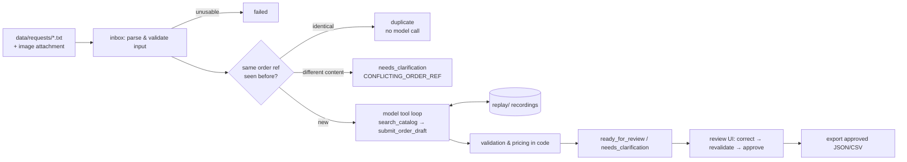

# AI Order Intake & Exception Handling

Junior AI Engineer take-home, **alternative A**. The app turns free-text customer order requests into draft orders. It flags unknown products, ambiguous quantities, duplicates and conflicts, and drafts a clarification. Every draft waits for a person to correct and approve it.

A model reads the request and proposes SKUs and quantities by calling a catalog lookup tool. **Code** decides everything else: it checks every proposal, computes prices, discounts and totals, detects duplicates and sets statuses. A draft that passes validation is only `ready_for_review`; it becomes `approved` only when a person approves it.

```
12 requests → 9 orders · 5 ready for review · 5 need clarification · 1 duplicate · 1 failed
17/17 checks PASS on recorded real responses (openai/gpt-6-luna) — reports/minimum-demonstration.md
```

## Quick start: no API key needed

Requires Python 3.12 and [uv](https://docs.astral.sh/uv/) (tested with uv 0.11.2).

```bash
git clone https://github.com/volsSha/order-intake-ai.git && cd order-intake-ai
uv sync
uv run order-intake check     # rebuild everything from saved real responses, compare with expected results
uv run order-intake process   # process data/requests/ into var/intake.db (replay mode)
uv run order-intake serve     # http://127.0.0.1:8000
```

`LLM_MODE` defaults to `replay`. In that mode the app answers every model call from the recorded real responses in `replay/` and never contacts a provider. `check` exits non-zero if any expectation fails.

Suggested walkthrough in the UI:
1. **Dashboard:** status counts, exception reasons and the suggested improvement.
2. **Queue:** filter by status.
3. **R7** ("10 USB-C cables"): the model correctly marks it as ambiguous. Choose `CAB-1`, save, check that the total is $180.00 (18000 cents, 10% discount), then approve.
4. **Export** the approved orders as JSON or CSV.
5. **R10** (an email trying to set the price) and **R11** (an order sent only as an image) are worth opening too.

## Live mode: real model calls

```bash
cp .env.example .env          # set OPENROUTER_API_KEY (or OPENAI_API_KEY)
uv run order-intake process --mode live --db var/live.db
```

| Variable | Default | Meaning |
|---|---|---|
| `OPENROUTER_API_KEY` | – | Preferred provider |
| `OPENAI_API_KEY` | – | Fallback: OpenAI directly, used when there is no OpenRouter key |
| `LLM_PROVIDER` | `auto` | `auto` uses OpenRouter, then OpenAI, then none (replay only); can be forced to `openrouter` or `openai` |
| `MODEL_ID` | `openai/gpt-6-luna` | OpenRouter model ID; for OpenAI direct the `openai/` prefix is removed |
| `OPENAI_MODEL_ID` | – | Overrides the OpenAI model name |
| `MODEL_REASONING_EFFORT` | `low` | Reasoning effort |
| `LLM_MODE` | `replay` | `live` always calls the API and records the response; `replay` never calls it; `auto` replays a recording and calls live only when none exists |
| `DB_PATH` | `var/intake.db` | SQLite file |

Other model parameters are fixed in `src/order_intake/config.py`: `seed=7`, `max_completion_tokens=4000`, at most 6 model calls per request, a 60 s timeout, and one retry after an invalid output. The temperature is the provider default. Recording all 12 requests cost about **$0.0023** (from OpenRouter's reported usage).

Labelled simulated failures (no API call): `uv run order-intake process --simulate R1=model_unavailable --simulate R5=invalid_output`.

## Architecture



| Module | Responsibility |
|---|---|
| `inbox.py` | Parses email-style request files and rejects unusable input before any model call |
| `catalog.py` | Catalog lookup (by SKU, or by description using token overlap), and deterministic detection of ambiguous wording |
| `llm.py` | OpenAI-SDK client for OpenRouter or OpenAI, with record and replay and simulated failures |
| `extraction.py` | Tool-calling loop with a step limit and one repair retry |
| `schemas.py` | Strict JSON-schema tool definitions generated from Pydantic |
| `validation.py` | All business rules: SKU from a lookup, wording matches exactly one product, quantity stated as items, pricing, statuses, clarification text |
| `pricing.py` | Integer cents; 10% off lines with at least 10 items, rounded half up |
| `pipeline.py` | Batch processing, dedupe and conflicts, idempotent reprocessing, corrections, approval |
| `storage.py` | SQLite: requests, orders (one per order ref), versioned proposals, model and tool calls, audit log |
| `evaluation.py` | `order-intake check`: runs on a fresh DB and compares with `data/reference/expected.json` |
| `web/` | FastAPI + Jinja2 + HTMX review UI |

See [`docs/ARCHITECTURE.md`](docs/ARCHITECTURE.md) for the design decisions and why each one was made.

## Data and assumptions

- `starter/` holds the unmodified starter pack (`starter/SHA256SUMS`). `data/` holds the catalog (copied verbatim), the 4 seed requests and 8 added requests: description match, per-line discount, ambiguous product, vague quantity, conflicting order reference, a prompt-injection attempt, an image-only order and unusable input. [`data/GENERATION.md`](data/GENERATION.md) describes how they were made.
- **Reference cases:** 12 cases in [`data/reference/expected.json`](data/reference/expected.json), 5 of them marked as the minimum demonstration. They were written by hand before running the app. `uv run python scripts/verify_reference.py` re-checks their arithmetic with `fractions` and does not import the app.
- **Assumptions** where the rules are silent ([`docs/ASSUMPTIONS.md`](docs/ASSUMPTIONS.md)), always the conservative choice:
  - the same order reference with different content is a conflict, not a new order;
  - containers and vague amounts need clarification;
  - prices written in the email are ignored;
  - the same SKU on two lines is flagged rather than merged;
  - a correction after approval needs a new approval.

## Checks

```bash
uv run pytest            # 57 tests: core rules, pipeline, LLM layer, web
uv run ruff check .
uv run order-intake check
```

The results are in [`reports/minimum-demonstration.md`](reports/minimum-demonstration.md); the expected-vs-observed table is also in `reports/check-results.json`.

## Time spent

About **2 hours** of my own time, working with an AI coding assistant (Claude Code). See [`docs/LLM_USAGE.md`](docs/LLM_USAGE.md). The stage-by-stage log is [`docs/DEV_JOURNAL.md`](docs/DEV_JOURNAL.md).

## Known limitations

- 12 requests show the intended behaviour; they are not evidence of accuracy on real email traffic.
- The rounding rule is never triggered by the supplied catalog, because every price is a multiple of 1000 cents. Unit tests cover it with synthetic prices.
- Matching by description uses token overlap over a 3-item catalog. A real catalog would need proper search, with code still deciding when wording is ambiguous.
- Clarifications are drafted but never sent. Customer replies are not linked back to the order.
- An order cannot be amended. A changed resend with the same reference stays a conflict for a person to resolve.
- There is one reviewer and no authentication; the reviewer name is free text.
- A request file whose content changes after processing is skipped and reported rather than reprocessed.

## Repository map

| Path | Content |
|---|---|
| `docs/` | Architecture, assumptions, development journal, LLM usage note, insights, presentation, submission notes |
| `prompts/extract_order.md` | System prompt used by the application |
| `replay/` | Recorded real model responses, one JSON file per call |
| `reports/` | Generated check results |
| `ai-workflow/` | AI development setup: manifest, README and sanitized configuration snapshots |
| `CLAUDE.md` | Agent instructions for this project |
