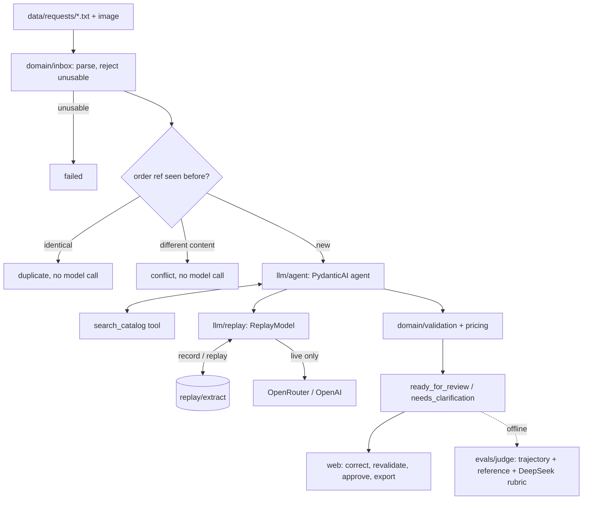

# Architecture and design decisions

## Division of work between model and code

| Step | Who | Why |
|---|---|---|
| Parse the request file and reject unusable input | Code | Needs no model, and must work while the model is down |
| Detect a duplicate or a conflicting order reference | Code, before any model call | Rule 4 is exact; it costs nothing and is never wrong |
| Read the free text or image and find the products and quantities | **Model** | The one step that needs language understanding |
| Catalog lookup | Code, exposed as the `search_catalog` tool | The model sees only what the catalog returns |
| Decide whether a proposal can be accepted | Code ([`validation.py`](../src/order_intake/domain/validation.py)) | Checks that cannot be argued around (below) |
| Price, discount, total | Code ([`pricing.py`](../src/order_intake/domain/pricing.py)), integer cents | The model never produces a number that ends up in a total |
| Clarification text | Model writes the questions; code adds the fixed frame | The model's wording is used only when the model itself raised every issue |
| Approval | A person | `ready_for_review` ≠ `approved` |
| Quality evaluation | A second model family, offline | Measures quality and drift; never changes an order |

## Validation checks on a model proposal

A model line is accepted only if every check passes. Otherwise it is kept, flagged and left unpriced.

1. **The SKU exists** in the catalog (`SKU_NOT_IN_CATALOG`).
2. **The SKU came from a `search_catalog` result in the same run** (`SKU_NOT_FROM_LOOKUP`). This blocks SKUs the model made up or remembered.
3. **The wording matches exactly one product.** Code re-runs the description match. If several products tie, the line is `AMBIGUOUS_PRODUCT` even when the model said `matched`.
4. **The model's own uncertainty is respected**: `unknown`/`ambiguous` product status, `unclear` unit, vague quantity.
5. **Containers are blocked in code.** A box, pack, case, carton, crate or pallet in the quantity text gives `NON_ITEM_UNIT`, whatever unit the model claimed. This was added after a test found that a model label alone let "2 boxes" through.
6. **The quantity appears in the request text**, as digits or a number word, including compounds such as "twenty-one" (`QUANTITY_NOT_IN_SOURCE`). The check is skipped for image-only requests.
7. **The product wording appears in the request text.** A mismatch raises a warning and does not block the line.

Reviewer corrections go through the same `validate_lines` with `author="reviewer"`. Checks 2–7 describe what the model read, so they do not apply to a reviewer. The catalog check and the positive-integer check still apply.

## Agent ([`llm/agent.py`](../src/order_intake/llm/agent.py))

**Framework choice.** Up to stage 8 the tool loop was about 60 hand-written lines on the `openai` SDK. In stage 9 it moved to **PydanticAI 2.54** at the user's decision: a standard framework expresses the same limits declaratively, and its sibling `pydantic-evals` gives the judge suite a ready structure. LangGraph was rejected as a graph for two tools, the OpenAI Agents SDK because it is tied to one provider. Record/replay is not in the framework, so it stays custom (below).

The agent has:
- `search_catalog`: a sequential, strict function tool. It records in the run's `deps` the SKUs the catalog actually returned; validation later accepts only those.
- `submit_order_draft`: a strict `ToolOutput`, the only way to finish.
- `end_strategy="exhaustive"`: a search sent in the same response as the submit still runs and still counts as looked up.
- `UsageLimits(request_limit=6)`: at most 6 model requests, then `STEP_LIMIT`.
- **One repair in total.** PydanticAI counts retries separately for text replies, unknown tools and invalid output. A `before_model_request` hook enforces a single repair across all three, then `INVALID_MODEL_OUTPUT`. Without it, an unknown tool name looped to the step limit; the probe that showed this is in the journal.
- `capture_run_messages()`, so the raw `submit_order_draft` arguments are stored even when a run fails.

| Failure | Code |
|---|---|
| `UsageLimitExceeded` | `STEP_LIMIT` |
| `UnexpectedModelBehavior` | `INVALID_MODEL_OUTPUT` |
| Provider HTTP or API error | `MODEL_UNAVAILABLE` |
| Missing recording in replay mode | `REPLAY_MISSING` |

## Record and replay ([`llm/replay.py`](../src/order_intake/llm/replay.py))

`ReplayModel` is a PydanticAI `WrapperModel` that overrides only `request`. There is one instance per run, so it knows the request id and step and can write the `llm_calls` row itself.

- **Key.** sha256 of a canonical request:
  - messages with timestamps and provider ids removed;
  - tool-call ids renumbered;
  - images replaced by their hash;
  - tool definitions;
  - the logical model id plus seed, token limit and reasoning effort from settings.

  The key does not depend on the provider, so a response recorded through OpenRouter replays with only OpenAI configured. Any change to the prompt, the request or a setting is a miss, never a stale answer.
- **Modes.** `live` records, `replay` never calls a provider, `auto` replays and calls only on a miss. Writes are atomic.
- **Labels.** Every call is labelled `live`, `replay` or `simulated` in the database, the UI and the reports. The simulated `model_unavailable` and `invalid_output` failures never call a provider.
- **Safety net.** In tests, `ALLOW_MODEL_REQUESTS = False` blocks real calls. Replay does not need them.

Layout and file format: [`replay/README.md`](../replay/README.md).

## LLM judge ([`evals/`](../src/order_intake/evals/))

`order-intake judge` builds a pydantic-evals dataset and runs it offline. The dataset has:
- the 12 reference requests;
- 3 unlabelled requests (J1–J3);
- 6 seeded defects, each a code mutation of a clean result.

Three evaluators run on each case:

| Evaluator | Kind | What it checks |
|---|---|---|
| Trajectory | deterministic | Requests within the cap, search before submit, every submitted SKU searched, no repeated searches, exactly one submit. Built from the tool calls linked to the proposal's model calls |
| Reference | deterministic | The same comparison as `order-intake check`, reused through an adapter |
| Rubric judge | `deepseek/deepseek-v4.1-flash` | Five criteria with a verdict of pass, fail or cannot_verify each, and a verbatim evidence quote |

Decisions:
- **Different family.** The pipeline uses an OpenAI model, so the judge is DeepSeek. This avoids self-preference bias. A same-family `JUDGE_MODEL_ID` is a configuration error, and there is no OpenAI judge fallback.
- **Blind.** The judge sees the request (text or image), the catalog, the rules and the validated result. It never sees the expected answers, case names, defect labels or the trajectory.
- **Quotes checked in code.** A quote that is not in the inputs turns the verdict into `cannot_verify`. Quotes from the image (R11) are kept but flagged.
- **Deterministic wins.** Any deterministic failure makes the case fail, whatever the judge says. The judge cannot be talked into a pass by text in the request.
- **Noise versus drift.** There are three samples per case, and the baseline keeps the majority, so a single-sample flip is noise. A regression is a majority flip within the same envelope: judge model, rubric version and corpus fingerprint.
- **Calibration.** Detection per defect class, false fails on clean cases, and agreement and Cohen's kappa on the judge's own verdict, all with counts.

Current results are in [`reports/judge-report.md`](../reports/judge-report.md). The finding they revealed is in [`docs/INSIGHTS.md`](INSIGHTS.md).

## Storage ([`storage.py`](../src/order_intake/storage.py), SQLite)

- `orders.order_ref` is the primary key, so one order per reference is a database constraint.
- Proposals are versioned and append-only. The author is `model`, `system` or the reviewer.
- `llm_calls`, `tool_calls` (linked to their call id) and `audit_log` make every proposal traceable.
- Schema upgrades only add columns; nothing is dropped.
- Reprocessing is idempotent.

## UI

Server-rendered Jinja2 with htmx 2.0.4, vendored so it works offline. htmx is used only for the queue filter; everything else is plain forms. Synchronous database work runs off the event loop.

## Alternatives not taken

| Option | Why not |
|---|---|
| Let the model compute totals | Arithmetic is deterministic; a model error would be silent |
| One model call returning JSON, no tools | The SKU could not be tied to a real catalog lookup |
| VCR-style HTTP cassettes for replay | They match on URL, not on the request body, and every LLM call hits the same endpoint. Keying on the canonical model request is exact |
| `LLMJudge` from pydantic-evals | It returns one pass and one score; per-criterion verdicts with checked evidence need a custom evaluator |
| Showing judge verdicts in the UI | Out of scope by decision; the judge is an offline tool |
