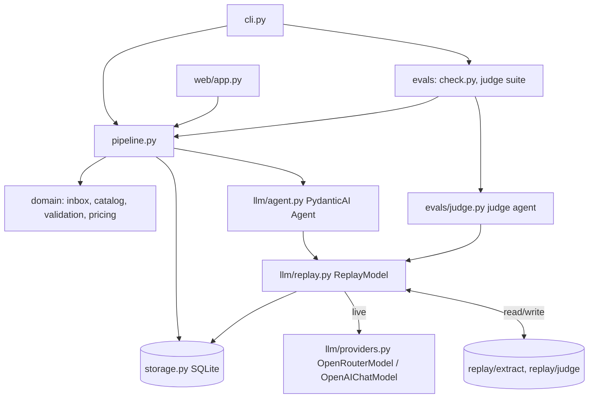
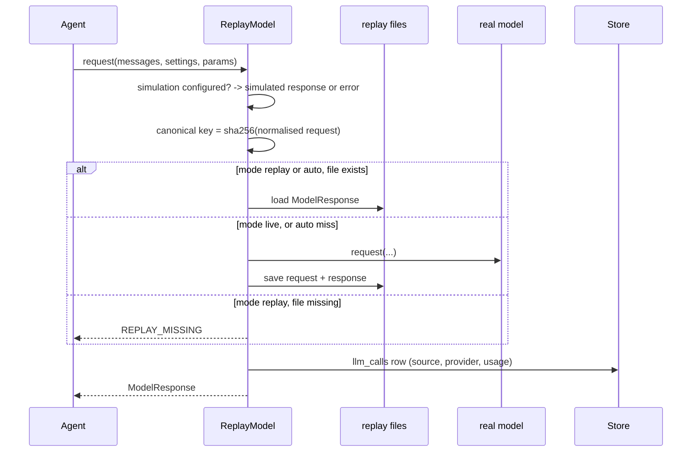
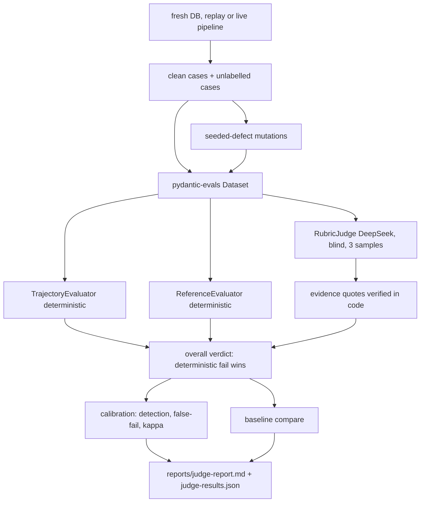

# PydanticAI migration, LLM judge and repository structure - Plan

## Goal Capsule

- **Objective:** A reviewer can clone the repository, run every check and the LLM-judge evaluation without an API key, and find each part of the work from linked indexes. The extraction pipeline keeps its current behaviour, and an independent judge measures its quality and detects drift.
- **Means:** PydanticAI agent behind a record/replay wrapper model (KTD1, KTD5), pydantic-evals judge suite (KTD10), package layout `domain` / `llm` / `evals` / `web` (KTD4).
- **Authority:** `starter/orders/domain.md` rules > `data/reference/expected.json` > this plan > existing code. `CLAUDE.md` architecture rules stay binding.
- **Stop conditions:** Stop and ask if re-recorded live output changes a field that R2 freezes and the rules do not explain. Stop if PydanticAI cannot keep the SKU-from-lookup guarantee; U3 proves that first.
- **Execution profile:** Sequential units. U4 and U6 need the OpenRouter key in `.env` and make paid calls of a few cents.
- **Tail ownership:** Commit per unit. Push to the public remote only after the secret scan passes.

---

## Product Contract

### Summary

Replace the hand-written tool loop with a PydanticAI agent while keeping record/replay and all current behaviour. Add an offline LLM-as-judge suite that grades every proposal-producing result with a different model family, checks every result deterministically, and checks the agent trajectory. Reorganise the code and tests into packages, strengthen the tests, add CI, and rewrite the README and folder indexes for navigation.

### Problem Frame

The application works and passes 17/17 reference checks, but three gaps remain. The LLM layer is a custom loop that a reviewer must read line by line to trust; a standard framework expresses the same limits declaratively. Quality is checked only against 12 hand-written expectations, so nothing measures output quality on its own terms or shows when a prompt or model change makes the agent drift. The flat module and test layout and the long README make the project hard to navigate for a reviewer with limited time.

### Requirements

**Structure and standards**
- R1. Code is organised into packages `domain` (catalog, pricing, inbox, validation), `llm` (agent, replay model, providers, schemas), `evals` (reference check, judge suite) and `web`, with orchestration modules at the package root.
- R2. Pipeline behaviour is unchanged after migration and re-recording. Per request, the status, line SKUs, quantities and prices, totals and finding codes stay identical, and a clarification draft exists wherever one existed. Model-written clarification wording may change and is reviewed by hand.
- R3. The CLI keeps `process`, `status`, `check` and `serve` with their flags, and adds `judge`.

**LLM layer**
- R4. Extraction runs on a PydanticAI agent with the `search_catalog` tool and the `submit_order_draft` output.
- R5. Every model call is recorded and can be replayed without an API key. Each call is labelled `live`, `replay` or `simulated`. The simulated failures `model_unavailable` and `invalid_output` keep working.
- R6. Provider resolution stays: OpenRouter if its key is set, else OpenAI directly, else replay only.
- R7. Limits and error codes stay: at most 6 model requests, one repair retry for invalid output, and the codes `STEP_LIMIT`, `INVALID_MODEL_OUTPUT`, `MODEL_UNAVAILABLE`, `REPLAY_MISSING`.

**LLM judge**
- R8. A judge model from a different family than the pipeline grades each result that has a proposal. Results without a proposal (duplicate, conflict, failed) get deterministic checks only. The default judge is `deepseek/deepseek-v4.1-flash`; `JUDGE_MODEL_ID` overrides it. A judge from the same family as the pipeline is a configuration error, where family means the vendor prefix of the model id.
- R9. The judge is blind. It sees the request (text or image), the catalog, the rules and the validated result. It never sees the expected answers, case names, seeded-defect labels, the recorded trajectory or tool-call arguments.
- R10. Judge verdicts are per criterion (`pass`, `fail`, `cannot_verify`) with a verbatim evidence quote. Code verifies the quotes and computes the overall verdict.
- R11. Deterministic trajectory checks flag agent drift: request count within the cap, search before submit, every submitted SKU searched, no repeated identical searches, exactly one submit.
- R12. A deterministic evaluator compares each result with `data/reference/expected.json`.
- R13. Seeded-defect cases and a small unlabelled case set measure the judge.
  - Metrics are computed on the judge's own verdict: detection rate per defect class, false-fail rate on clean cases, agreement and Cohen's kappa.
  - Every rate is shown with its counts and `n`.
  - The unlabelled cases have no expected answer and are reviewed by hand.
- R14. A committed baseline lets a later run flag regressions per case and criterion.
  - The baseline holds the majority of three judge samples per case, so judge noise is measured and not reported as drift.
  - A documented live drift run re-records the pipeline and the judge after a prompt or model change and compares with the baseline.
  - The offline run in CI checks reproducibility only.
- R15. `order-intake judge` runs offline from recorded judge calls and writes a Markdown and a JSON report.

**Tests and CI**
- R16. Tests are split per module and use parametrized boundaries and property-based pricing tests.
- R17. Tests check replay hygiene (valid files, no orphans), secrets across every tracked file, and the starter-pack checksums.
- R18. A coverage gate applies to the deterministic modules.
- R19. GitHub Actions runs lint, tests, `check` and `judge` with no API key.

**Documentation**
- R20. The README is short, readable and links to every file it mentions. Each top-level folder has an index README.
- R21. Architecture, LLM usage, journal, insights, presentation and `ai-workflow` records reflect stage 9, including copies of the skills used. Time spent is stated as about 5 hours.

### Key Decisions

- **The judge is an offline evaluation tool.** It never changes an order status and is not shown in the review UI. Governs R8, R15. (session-settled: user-approved — chosen over judging each request in production and showing verdicts in the UI: keeps the reviewer flow and the cost unchanged)

### Scope Boundaries

- Business rules, statuses and the review UI flow do not change.
- All request data is fictional (starter-pack rules), so sending it to model providers and committing recordings needs no redaction policy.
- No judge results in the UI.
- No streaming responses.

#### Deferred to Follow-Up Work

- Judge verdicts shown to the reviewer next to each proposal.
- Logfire or OpenTelemetry tracing.

---

## Planning Contract

### Key Technical Decisions

- KTD1. **PydanticAI 2.54 for the extraction loop.** Typed tools, `UsageLimits`, output retries, provider classes and `FunctionModel` replace custom code. Pin `pydantic-ai-slim[openai]==2.54.0` and `pydantic-evals==2.54.0`. (session-settled: user-directed — chosen over keeping the hand-written openai SDK loop, LangGraph or the OpenAI Agents SDK: a standard framework with the same features and a matching evals library)
- KTD2. **Judge from another model family.** Default `deepseek/deepseek-v4.1-flash` on OpenRouter: image input, tools, structured output, seed. (session-settled: user-directed — chosen over a judge from the pipeline's own family: avoids self-preference bias)
- KTD3. **Blind judge.** Reference agreement is computed separately in code. (session-settled: user-approved — chosen over a judge that sees expected answers: keeps the judge's own accuracy measurable)
- KTD4. **Package layout.** `domain/`, `llm/`, `evals/`, `web/`; `config.py`, `storage.py`, `pipeline.py`, `cli.py` stay at the package root. `ROOT` is found by walking up to `pyproject.toml`, not by a fixed parent count. (session-settled: user-directed — chosen over keeping flat modules and splitting only tests)
- KTD5. **Record/replay as a `WrapperModel` subclass.** It overrides only `request`. The key is sha256 of a canonical request:
  1. messages dumped as JSON with timestamps, run ids and provider ids removed;
  2. tool-call ids renumbered to ordinals;
  3. image bytes replaced by their sha256;
  4. tool and output-tool definitions (name, description, schema, strict);
  5. the logical model id from `Settings` (`MODEL_ID`, or `JUDGE_MODEL_ID` for the judge) plus `seed`, `max_tokens` and reasoning effort taken from `Settings`. It never uses the wrapped model's `model_name` or provider-specific setting keys, matching `ChatClient._canonical` today, so a recording replays under either provider.
  6. for judge calls, the sample index (KTD15).

  Responses are stored with `ModelResponse` serialization in files carrying a `format_version`. Writes are atomic (temp file, then rename). Errors and simulations write no replay file, but they still write their `llm_calls` row; a replay miss row records the missing key. Replay never calls the provider, so `ALLOW_MODEL_REQUESTS=False` blocks only real calls. In replay mode the wrapper wraps a real model built with a placeholder key, so the model profile stays identical.

  Partial runs:
  - A miss in the middle of a replay run raises `REPLAY_MISSING` and keeps the earlier `llm_calls` rows. The miss row records the key it looked for.
  - In `auto` mode, a run that died at step N replays steps 1..N-1 and records from step N.
- KTD6. **Agent shape.**
  - `search_catalog` is a sequential function tool that records the SKUs it returned in `deps`.
  - `submit_order_draft` is a strict `ToolOutput` with one output retry.
  - `end_strategy='exhaustive'`, so a search in the same turn as the submit still runs.
  - Tool retries are at least the step cap, so bad search arguments do not consume the repair budget.
  - Exceptions map to codes:

    | Exception | Code |
    |---|---|
    | `UsageLimitExceeded` | `STEP_LIMIT` |
    | `UnexpectedModelBehavior` | `INVALID_MODEL_OUTPUT` |
    | `ModelAPIError` / `ModelHTTPError` from the wrapped model | `MODEL_UNAVAILABLE`; the wrapper writes a live row with the error |

  - A text-only reply or an unknown tool name becomes a retry prompt that uses the output retry. A second one ends in `INVALID_MODEL_OUTPUT`.
  - The agent runs inside `capture_run_messages()`, so the raw `submit_order_draft` arguments are stored even when a run fails.
  - `validation.py` stays the deciding check; no business rule moves into `ModelRetry`.
- KTD7. **`OpenRouterModel` for OpenRouter, `OpenAIChatModel` for OpenAI.** `OpenAIChatModel` with an OpenRouter provider ignores `openrouter_*` settings. `app_title` replaces the `X-Title` header. The 60 s timeout and one SDK retry of today's client carry over. In replay mode with no key, the wrapper wraps an `OpenRouterModel` built with a placeholder key.
- KTD8. **One wrapper instance per run.** It carries the request id, the step counter, the store and the call-id list, so it can write `llm_calls` rows (including failures) without context variables. Building the provider per run also avoids sharing one HTTP client across event loops in FastAPI worker threads.
- KTD9. **Usage normalised in the record.** `usage` keeps `input_tokens`, `output_tokens`, `total_tokens` and `cost` (from OpenRouter `provider_details`), so the UI and dashboard keep working.
- KTD10. **Judge as a custom evaluator.** A PydanticAI judge agent runs inside a pydantic-evals `Evaluator`. It is not `LLMJudge`, because `LLMJudge` returns one pass and score, while R10 needs per-criterion verdicts with evidence. Each verdict stores the judge model id and the rubric version.
- KTD11. **Reports rendered in code.** pydantic-evals has no Markdown renderer. `reports/judge-report.md` and `reports/judge-results.json` are written by `evals/`.
- KTD12. **Replay namespaces.** `replay/extract/<request>/` for the pipeline and `replay/judge/<case>/` for the judge, so case ids never collide with request ids.
- KTD13. **Coverage gate on deterministic code only.** `domain`, `storage`, `pipeline` and the deterministic `evals` parts, with `fail_under = 90`. Live-provider paths are excluded.
- KTD14. **Judge provider resolution.** A live judge needs an OpenRouter key; otherwise the judge is replay-only. There is no OpenAI fallback for the judge, because an OpenAI-hosted judge would share the pipeline's family (R8). Judge `llm_calls` rows go to the evaluation's temporary database, not the user's database.
- KTD15. **Three judge samples per case for the baseline.** The sample index is part of the replay key. The verdict per criterion is the majority of the samples, and the agreement rate between samples is reported as the noise floor. A regression is a majority flip.
- KTD16. **Judge prompt from a canonical projection.** The prompt is built from:
  - the request text, or the image itself;
  - the catalog and the rules;
  - the proposal's lines, status, finding codes and clarification.

  Timestamps, versions, call ids and tool-call ids are excluded, so the judge key is stable across fresh databases.
- KTD17. **Trajectory from tool calls linked to the proposal.** Each `tool_calls` row gets the `llm_call_id` that produced it. The trajectory is the proposal's `llm_call_ids`, then their tool calls in step and emission order.
- KTD18. **Calibration on the judge-only verdict.**
  - Kappa is computed per case.
  - `review` counts as not-fail.
  - `inconclusive`, `judge_error`, `judge_unavailable` and `pipeline_unavailable` are excluded, with the excluded count reported.
  - Targets are reported, not gated: judge-only detection of at least 80% on judge-relevant classes, and at most one false fail on clean cases.
  - The baseline is keyed by judge model id, rubric version and a corpus fingerprint, a hash of request files, catalog, expected results and both prompts. A different envelope gives a warning and no comparison.

### High-Level Technical Design

Component layout after the restructure:



One model request through the replay wrapper:



Judge suite flow:



### Output Structure

```text
src/order_intake/
  config.py  storage.py  pipeline.py  cli.py
  domain/    catalog.py  pricing.py  inbox.py  validation.py
  llm/       agent.py  replay.py  providers.py  schemas.py
  evals/     check.py  judge.py  trajectory.py  defects.py  report.py
  web/       app.py  templates/  static/
tests/
  domain/  llm/  evals/  web/  test_pipeline.py  test_repo_hygiene.py  conftest.py
replay/
  extract/<request>/   judge/<case>/
data/judge-cases/
.github/workflows/ci.yml
```

### System-Wide Impact

- **Entry points:**
  - the `order-intake` script and the uvicorn path `order_intake.web.app:app` keep their names;
  - the `pipeline.Pipeline` constructor swaps its `client` parameter for a model factory.
- **Stored data:**
  - `llm_calls` rows keep their columns, and `usage` keeps `total_tokens` and `cost`;
  - `tool_calls` still holds the raw `submit_order_draft` arguments for the detail page.
- **Replay files:** the old layout is deleted, not mixed in. Every reader moves to `replay/extract/` and `replay/judge/`.
- **Agent boundaries:**
  - the model still only proposes, and `validation.py` decides;
  - the judge only reads and never writes order state;
  - approval stays human-only.
- **Docs:** `README.md`, `docs/ARCHITECTURE.md`, `docs/LLM_USAGE.md`, `ai-workflow/README.md` and `ai-workflow/manifest.json` name modules and the SDK; all are updated in U8.

### Sources

- PydanticAI 2.54.0 installed source:
  - `models/wrapper.py`, `models/openrouter.py`, `providers/openrouter.py`;
  - `messages.py` (`ModelMessagesTypeAdapter`);
  - `models/__init__.py` (`ALLOW_MODEL_REQUESTS`);
  - pydantic-evals `evaluators/llm_as_a_judge.py`, `reporting/__init__.py`.
- Repo: `src/order_intake/llm.py` (replay modes, display helper), `extraction.py` (error mapping), `tests/conftest.py` (scripted lines), `docs/DEV_JOURNAL.md` stages 3, 6 and 7 (replay-key, `REPLAY_MISSING` and clarification lessons).
- Judge practice:
  - per-criterion pass/fail with evidence and a code-computed score;
  - self-preference bias across model families (arXiv 2508.06709);
  - judge prompt-injection risk (arXiv 2504.18333);
  - agreement and kappa calibration before trusting a judge.

### Risks & Dependencies

| Risk | Mitigation |
|---|---|
| Re-recording changes model output, so a reference status may move | Read each proposal (stage-7 practice). A real regression stops the run per the Goal Capsule |
| PydanticAI internals (message fields, `WrapperModel`) change between versions | Pin `==2.54.0`; key-stability tests catch drift on upgrade |
| DeepSeek output varies run to run | Recordings are the evidence; the baseline stores model id and rubric version |
| Judge prompt injection from request text | Delimited data, verbatim quotes checked in code, deterministic checks override the judge, seeded injection case |
| Event-loop reuse in FastAPI worker threads | Per-run provider and model instance (KTD8); sync routes only |
| The judge only catches what deterministic checks already catch | Judge-only detection is reported separately |

### Assumptions

- The OpenRouter key in `.env` stays valid for the two recording runs.
- `deepseek/deepseek-v4.1-flash` accepts `seed` on OpenRouter, but outputs may still vary between runs. The recordings are the source of reproducibility.

---

## Implementation Units

### U1. Package restructure with unchanged behaviour

**Goal:** Move modules into `domain/`, `llm/` and `evals/` and split the tests per module, with no behaviour change.

**Requirements:** R1, R3, R16 (split only)

**Dependencies:** none

**Files:**
- Move `src/order_intake/{catalog,pricing,inbox,validation}.py` to `src/order_intake/domain/`.
- Move `llm.py`, `extraction.py` and `schemas.py` to `src/order_intake/llm/`, as an interim step before U3.
- Move `evaluation.py` to `src/order_intake/evals/check.py`.
- Update `config.py` (ROOT detection, KTD4), `cli.py`, `web/app.py` and `pyproject.toml`.
- Split `tests/test_core.py` into `tests/domain/test_pricing.py`, `test_catalog.py`, `test_inbox.py`, `test_validation.py` and `test_clarification.py`.
- Move `tests/test_llm.py` to `tests/llm/` and `tests/test_web.py` to `tests/web/`.

**Approach:**
- Use `git mv` so history shows renames.
- Package `__init__.py` files re-export nothing; imports name the module.
- `tests/conftest.py` stays at the root; sub-folders need no `__init__.py` once imports use the package path.

**Patterns to follow:** Existing relative imports in `web/app.py`.

**Test scenarios:**
- All existing tests pass unchanged apart from import paths.
- `order-intake check` passes in replay mode with the current recordings.
- Edge case: `ROOT` resolves correctly when the installed package is imported from a different working directory.

**Verification:** Same test count and same `reports/check-results.json` statuses as before the move.

### U2. Deterministic test quality

**Goal:** Strengthen the deterministic tests and add repository hygiene checks.

**Requirements:** R16, R17, R18

**Dependencies:** U1

**Files:**
- `tests/domain/test_pricing.py`, `tests/domain/test_validation.py`, `tests/domain/test_inbox.py`
- `tests/test_repo_hygiene.py`, `tests/conftest.py` (Hypothesis profiles)
- `pyproject.toml` (markers, coverage configuration, `hypothesis` and `pytest-cov` dev dependencies), `uv.lock`

**Approach:**
- Parametrize boundary tables: quantities 9/10/11, number words, container words, vague amounts.
- Hypothesis properties for `price_line`:
  - `total = subtotal - discount`;
  - no discount below 10 items;
  - the discount equals the `Fraction`-based half-up 10%.

  A derandomized CI profile is registered in `tests/conftest.py`; Hypothesis does not read `pyproject.toml`.
- Hygiene tests:
  - every replay file parses and has the expected keys;
  - orphans: every replay file must belong to a known request or judge case, and a full replay run must read it;
  - secrets:
    - every file from `git ls-files` is checked against key-shaped patterns (`sk-` followed by 20 or more key characters; `Authorization: Bearer` followed by a token);
    - every file is also checked against the literal values of any `*_API_KEY` in a local `.env`, never printing them;
    - `.env` must not be tracked;
  - the `starter/` files match `starter/SHA256SUMS`.
- Markers `unit` and `integration`. Coverage per KTD13.

**Test scenarios:**
- Edge case: quantity 10 gets a discount and quantity 9 does not.
- Edge case: rounding at exactly half a cent rounds up (synthetic price).
- Property: for any unit price 1..10^6 and quantity 1..10^4, the line invariants hold.
- Error path: a planted fake key in a temporary file is detected by the scanner function.
- Negative case: prose containing the words "Authorization" or "Bearer" does not trip the scanner.
- Error path: an unreferenced replay file is reported as an orphan.
- Error path: a modified starter file fails the checksum test.

**Verification:** The hygiene tests pass on the current repository. The coverage gate is configured here and enforced from U3, once the new modules exist.

### U3. PydanticAI extraction agent and replay model

**Goal:** Replace `ChatClient` and the hand-written loop with a PydanticAI agent behind `ReplayModel`.

**Requirements:** R4, R5, R6, R7

**Dependencies:** U1

**Files:**
- `src/order_intake/llm/agent.py`, `src/order_intake/llm/replay.py`, `src/order_intake/llm/providers.py`, `src/order_intake/llm/schemas.py`
- `src/order_intake/pipeline.py`, `src/order_intake/cli.py`, `src/order_intake/evals/check.py`
- Remove `src/order_intake/llm/llm.py` and `extraction.py` once replaced.
- `tests/conftest.py`, `tests/llm/test_replay.py`, `tests/llm/test_agent.py`, `tests/llm/test_providers.py`, `tests/test_pipeline.py`
- `pyproject.toml`, `uv.lock`

**Approach:**
1. `providers.py` builds the real model from `Settings.resolve_provider()` per KTD7, with seed, `max_tokens`, reasoning effort, the timeout and one SDK retry.
2. `replay.py` implements KTD5, KTD8 and KTD9. It owns simulations, the `llm_calls` rows and the replay file format, which gains a `format` version field.
3. `agent.py` builds the agent per KTD6. It runs it with `run_sync` inside `capture_run_messages()`, writes `tool_calls` rows with their `llm_call_id` (KTD17), including the raw `submit_order_draft` arguments, and maps exceptions to codes.
4. The pipeline receives a model factory instead of a client. The `client_factory(settings, simulate=...)` seam in `evals/check.py` becomes a model-factory seam with the same role.
5. Test fixtures replace `FakeClient` with a `FunctionModel` driven by the existing `SCRIPTED` lines. `ALLOW_MODEL_REQUESTS=False` is set for the whole suite.

**Execution note:** Start with a proof slice on fixtures before touching the pipeline. Show tool and output semantics, the request cap, the repair retry, key stability and the SKU-from-lookup guarantee with `FunctionModel`. If any of these fails, stop per the Goal Capsule.

**Patterns to follow:** `llm.py` mode handling and display helper, `extraction.py` error mapping, `conftest.py` scripted lines.

**Test scenarios:**
- Happy path: the scripted model searches, then submits, and the pipeline produces the reference statuses for all 12 requests.
- Integration: a search issued in the same response as the submit still counts as looked up.
- Error path: invalid submit arguments twice give `INVALID_MODEL_OUTPUT` with exactly 2 `llm_calls` rows.
- Error path: a model that keeps searching hits the cap and gives `STEP_LIMIT`.
- Error path: `model_unavailable` simulation gives `MODEL_UNAVAILABLE` and one `simulated` row, with no provider call.
- Error path: a replay miss at step 2 keeps the step 1 row, saves no proposal and records the missing key.
- Error path: a text-only reply followed by a second invalid reply gives `INVALID_MODEL_OUTPUT`.
- Error path: a `ModelHTTPError` from the wrapped model gives `MODEL_UNAVAILABLE` and a live row with the error.
- Error path: a failed run still stores the raw `submit_order_draft` arguments.
- Edge case: `auto` mode with no key and a missing recording gives `MODEL_UNAVAILABLE` with a clear message.
- Replay:
  - the same request gives the same key across runs, even with different timestamps and tool-call ids;
  - a changed prompt gives `REPLAY_MISSING`;
  - an image request keys on the image hash;
  - a recording made via OpenRouter replays when only OpenAI is configured.
- Edge case: `replay_dir` outside the repository displays without error.
- Providers: `OpenRouterModel` settings carry reasoning effort and seed; the OpenAI fallback strips the `openai/` prefix; a non-OpenAI model without an override raises `ConfigError`.
- Web: the call table still shows source, provider, tokens and cost from the normalised usage.

**Verification:** Full test suite passes with no network access.

### U4. Re-record the pipeline live

**Goal:** Replace the 18 old recordings with PydanticAI recordings and confirm parity.

**Requirements:** R2, R5

**Dependencies:** U3

**Files:** `replay/extract/` (new), `replay/R*/` (removed), `reports/check-results.json`, `reports/minimum-demonstration.md`, `docs/DEV_JOURNAL.md`

**Approach:**
- Keep a copy of the pre-migration `reports/check-results.json` outside the repo.
- Run live processing once on a fresh database.
- Compare per request the fields R2 freezes.
- Read each proposal and clarification as in stage 7.
- Then run `check` in replay mode with no keys.

**Execution note:** Paid live calls; secret-scan before committing.

**Test scenarios:** Test expectation: none -- this unit produces data; U2 hygiene tests and the `check` command verify it.

**Verification:**
- `check` passes 17/17 with both keys unset.
- A per-request comparison with the preserved report shows no difference in the fields R2 freezes.
- The hygiene tests pass on the new files.

### U5. LLM judge suite

**Goal:** Build the offline judge suite with deterministic evaluators, the blind rubric judge, seeded defects, calibration and baseline comparison.

**Requirements:** R8, R9, R10, R11, R12, R13, R14, R15

**Dependencies:** U3

**Files:**
- `src/order_intake/evals/judge.py` (judge agent, rubric, `RubricJudge` evaluator)
- `src/order_intake/evals/trajectory.py`, `src/order_intake/evals/defects.py`, `src/order_intake/evals/report.py`
- `src/order_intake/evals/check.py`: the `ReferenceEvaluator` is a thin pydantic-evals adapter over the existing comparison functions, with no second comparison logic.
- `data/judge-cases/`: three unlabelled paraphrased requests, judged but never in `expected.json`.
- `prompts/judge.md`
- `src/order_intake/config.py` (judge settings per KTD14), `src/order_intake/cli.py` (`judge` command with `--mode`, `--pipeline-mode`, `--samples`, `--update-baseline`)
- `tests/evals/test_trajectory.py`, `tests/evals/test_check.py`, `tests/evals/test_judge.py`, `tests/evals/test_defects.py`, `tests/evals/test_report.py`

**Approach:**
1. Build the dataset.
   - Process all requests, plus the unlabelled cases, on a fresh database. The default is from replay; `--pipeline-mode live` re-records the pipeline into a scratch replay directory for a drift run.
   - The judge prompt follows KTD16. The trajectory feeds only the `TrajectoryEvaluator`.
   - Duplicate, conflict and failed requests are cases with deterministic checks only. The judge is called only where the model produced a proposal.
2. Write the rubric criteria:
   - products mapped correctly;
   - quantities faithful;
   - ambiguity and unknowns flagged rather than guessed;
   - clarification asks only for missing details and does not imply unknown products exist;
   - instructions inside the request ignored.

   The rubric version is a constant included in the replay key and the baseline.
3. Judge prompt: the request goes inside data delimiters. The judge must quote evidence verbatim, and length is not a criterion. A quote that is not a substring of the text inputs downgrades that verdict to `cannot_verify`. The image case is the exception noted in the table below.
4. Compute the overall verdict:
   - any deterministic failure → `fail`;
   - else any judge `fail` → `fail`;
   - else any `cannot_verify` → `review`;
   - else `pass`.

   Case handling:

   | Case | Rule |
   |---|---|
   | All criteria abstain | `inconclusive`; excluded from kappa |
   | Image request (R10) | The judge sees the image. Quotes taken from the image cannot be string-checked, so request-derived verdicts are kept but flagged `quote_unverified` in the report |
   | Invalid judge schema | One retry, then `judge_error`; the other cases continue |
   | Pipeline replay miss | `pipeline_unavailable`; not judged |
   | Judge replay miss | `judge_unavailable` for that case; the run continues and exits non-zero |
   | Trajectory input | Per KTD17; never from all rows of the request, because retries leave old rows |
   | More than one submit | Trajectory failure |
   | No proposal (duplicate, conflict, failed, simulated failure) | Deterministic checks only: expected status, zero or expected model calls, nothing invented |
5. Seeded defects are code mutations of clean results:
   - wrong SKU;
   - changed quantity;
   - ambiguous line marked as matched;
   - clarification implying an unknown product exists;
   - invented line;
   - a request text carrying an instruction aimed at the grader together with a wrong quantity.

   Each mutation carries a hidden expected `fail` label that the judge never sees.
6. Calibration and baseline per KTD15 and KTD18:
   - judge-only detection is the headline figure, because deterministic checks already catch some defect classes (wrong SKU, invented line);
   - every rate is shown with counts and `n`;
   - kappa is N/A when all labels are equal;
   - `reports/judge-baseline.json` is written only with `--update-baseline`;
   - a normal run compares with it and lists regressions;
   - with no baseline, the run reports "no baseline" and exits 0;
   - if the evaluation envelope (KTD18) differs from the baseline, the run warns and skips the comparison;
   - regressions are reported and do not change the exit code; only missing judge recordings do.

**Execution note:** Implement the trajectory and reference evaluators test-first; they are the deterministic floor.

**Patterns to follow:** `evals/check.py` fresh-database run and report writing; `FunctionModel` fixtures from U3.

**Test scenarios:**
- Trajectory:
  - a scripted run with search then submit passes all checks;
  - submit without search fails;
  - a repeated identical query is flagged;
  - 6 requests is within the cap.
- Reference: a mutated quantity fails reference agreement; a duplicate case passes with no proposal.
- Judge parsing: a `FunctionModel` judge returning a fabricated quote gets `cannot_verify` for that criterion.
- Override: a judge `pass` on a case with a deterministic failure still gives overall `fail`.
- Calibration math: known label and verdict lists give the expected detection rate, false-fail rate and kappa.
- Baseline:
  - a criterion whose majority goes from pass to fail is reported as a regression; a single-sample flip within the noise floor is not;
  - with no baseline file the run reports "no baseline" and does not fail.
- Error path: a missing judge recording in replay mode marks that case `judge_unavailable`, the suite continues, and the exit code is non-zero.
- Error path: a judge that abstains on every criterion gives `inconclusive`, and the case is left out of kappa.
- Edge case: kappa with all labels equal is reported as N/A.
- Edge case: a baseline with a different rubric version gives a warning and no comparison.
- Edge case: a run with two submits fails the trajectory check.
- Image case: request-derived verdicts are kept and flagged `quote_unverified`.
- Blindness: the judge prompt contains no expected values, case names, defect labels or tool-call arguments.
- Stability: building the same case twice on two fresh databases gives the same judge replay key.
- Config: a `JUDGE_MODEL_ID` with the pipeline's vendor prefix raises `ConfigError`.

**Verification:** `order-intake judge` runs end to end against `FunctionModel` in tests and writes both reports.

### U6. Record the judge live and set the baseline

**Goal:** Record real DeepSeek judge calls, review them, and commit the reports and baseline.

**Requirements:** R13, R14, R15

**Dependencies:** U4, U5

**Files:** `replay/judge/`, `reports/judge-report.md`, `reports/judge-results.json`, `reports/judge-baseline.json`, `docs/DEV_JOURNAL.md`, `docs/INSIGHTS.md`

**Approach:**
- Run `judge --mode live --samples 3 --update-baseline` once.
- Review the unlabelled cases by hand.
- Read every verdict and evidence quote.
- If the judge misjudges a clean case, decide whether the fault is in the rubric or the pipeline. Record the decision in the journal before changing anything.
- Re-run in replay mode with keys unset.

**Execution note:** Paid live calls; secret-scan before committing.

**Test scenarios:** Test expectation: none -- data unit; verified by the replay run and the hygiene tests.

**Verification:**
- The replay run reproduces the committed reports.
- The seeded-defect detection rate and the clean false-fail rate are reported.
- Any miss is explained in the journal.

### U7. Continuous integration

**Goal:** Run every check on GitHub without secrets.

**Requirements:** R19

**Dependencies:** U2, U6

**Files:** `.github/workflows/ci.yml`

**Approach:**
- Use `uv` setup, `uv sync --frozen`, `ruff check`, `pytest` with the coverage gate, `order-intake check` and `order-intake judge`.
- No secrets are configured, and model requests are blocked.
- Set `permissions: contents: read`. Trigger on `push` and `pull_request` only, never `pull_request_target`.
- The offline `judge` run is a reproducibility check, not a drift gate.

**Test scenarios:** Test expectation: none -- configuration; verified by a green run on the pushed branch.

**Verification:** The workflow passes on GitHub for the pushed commit.

### U8. Documentation, indexes and AI-workflow records

**Goal:** Make the repository easy to navigate and the documentation current.

**Requirements:** R20, R21

**Dependencies:** U4, U6

**Files:**
- `README.md`
- `docs/README.md`, `data/README.md`, `replay/README.md`, `reports/README.md`, `prompts/README.md`, `scripts/README.md`, `tests/README.md`, `src/order_intake/README.md`
- `docs/ARCHITECTURE.md`, `docs/LLM_USAGE.md`, `docs/DEV_JOURNAL.md`, `docs/INSIGHTS.md`, `docs/PRESENTATION.md`, `docs/SUBMISSION.md`
- `ai-workflow/README.md`, `ai-workflow/manifest.json`, `ai-workflow/snapshots/skills/`
- `.env.example`, `ai-workflow/.env.example`, `CLAUDE.md`
- `tests/test_repo_hygiene.py` (link check)

**Approach:**
- The README becomes a short entry page:
  - what the app does;
  - quick start without a key;
  - the result numbers;
  - a "where to find what" table linking every folder index and key file;
  - links instead of long sections.
- Each folder index lists its files with one line each.
- `ARCHITECTURE.md` records the reversal from "no framework" to PydanticAI, with the reason.
- The `ai-workflow` records add the compound-engineering skills used (`ce-plan`, `ce-work`, `ce-code-review`, `ce-doc-review`, `ce-compound`) and any other skill actually invoked. Full folders are copied with the plugin licence, after a secret scan. Time spent: about 5 hours.
- `JUDGE_MODEL_ID` is added to both `.env.example` files.

**Test scenarios:** Test expectation: none -- documentation; the hygiene test scans `ai-workflow/` for secrets.

**Verification:** Every relative link in the README and indexes resolves to an existing file. A link-check helper in `tests/test_repo_hygiene.py` checks this.

---

## Verification Contract

| Gate | Command | When |
|---|---|---|
| Lint | `uv run ruff check .` | every unit |
| Tests and coverage | `uv run pytest` | every unit; coverage gate from U2 |
| Reference check offline | `env -u OPENROUTER_API_KEY -u OPENAI_API_KEY uv run order-intake check` | U1, U4, final |
| Judge offline | `env -u OPENROUTER_API_KEY -u OPENAI_API_KEY uv run order-intake judge` | U6, final |
| Secret scan | hygiene tests in `tests/test_repo_hygiene.py` | before every push |
| Fresh clone | clone, `uv sync`, `check`, `judge` with no keys | final |
| CI | GitHub Actions workflow green | U7, final |

## Definition of Done

- All units' verification outcomes hold. Lint, tests and the coverage gate pass.
- `check` passes 17/17 and `judge` completes, both offline from a fresh clone.
- The judge report states the detection rate, false-fail rate and kappa, and the journal explains any judge miss.
- No secrets in tracked files. No dead code from abandoned approaches (old `ChatClient`, `extraction.py`, old replay layout).
- The README and every index link resolve. The docs and `ai-workflow` records describe the final state.
- The work is pushed to the public repository with CI green.
